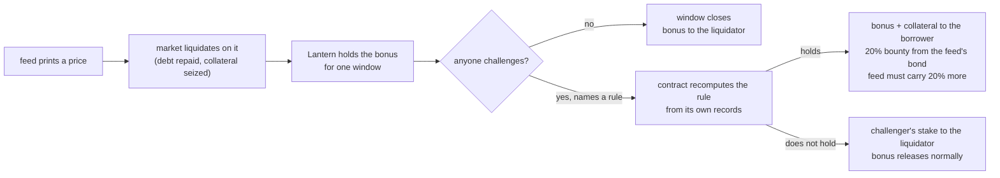
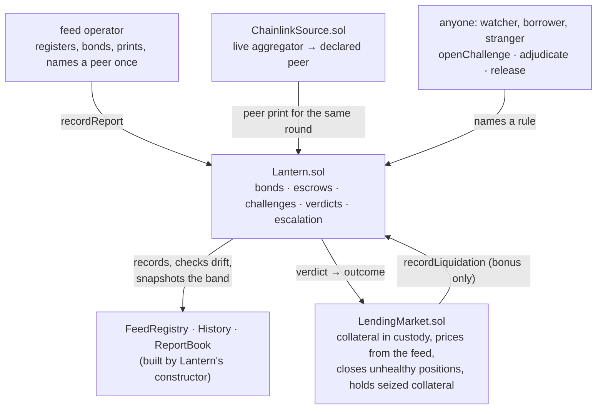

<div align="center">

# LANTERN

### A liquidator's bonus is held until someone proves the price behind it contradicted the record.

[](LICENSE)


[](https://github.com/BlackRiverHQ/lantern/actions/workflows/test.yml)

[](https://friendly-fennec-31.convex.site) [](https://friendly-fennec-31.convex.site/dashboard) [](https://arbitrum-sepolia.blockscout.com/address/0xcdce3a1b3ebf7fe1e340ab670e25fe768195ac54) [](https://youtu.be/cZGxXNKqNvk)

</div>

A liquidation consumes a price and produces a payment. If the price was wrong, the payment is real anyway:
the debt is repaid, collateral moves, and the liquidator is paid a bonus computed on that number.
Lantern makes the **bonus** provisional. It is held for five minutes, and in that window anyone can point
the contract at records that already exist on chain and have it recompute whether the price contradicted
them. If it did, the held bonus goes to the borrower, the market hands back the collateral it seized,
the challenger is paid out of the feed operator's bond, and the feed must carry more collateral before
it prices again. If nobody contests, the liquidator is paid in full.

The debt side is untouched. Repayment and the close happen at the moment of liquidation, exactly as
before. **What becomes disputable is the profit.**

```
EFFECTED   ≠   JUSTIFIED   ≠   FINAL
```

The liquidation is real the moment it happens. Whether its price held up is a separate question, and the
money that answers it is the bonus, which is held.

## Live status

| Surface | Status | The evidence |
|---|---|---|
| Six contracts | deployed, source-verified | Lantern, the market, the asset, the registry, the history store and the report book on Arbitrum Sepolia; exact Sourcify match on creation and runtime bytecode; `script/verify-source.sh all` passes all six |
| Liquidations | 7 | cases #9, #37, #41, #42, #44, #45, #51, each through the real market |
| Challenges | 6 opened, 6 upheld, 0 refused | every one decided by the contract; `watcher/`'s own recomputation agrees with all six |
| Caught prints | 6 | `feedErrors` 6 |
| Feed bond | 298,477 carried, 220,000 required | the 100,000 minimum, raised 20% for each of six caught prints (Lantern's own `requiredBond`) |
| Held right now | 0.00145 of the asset | case #41: its window closed unchallenged, so anyone can call `release` |
| Watcher | live, run by us | decided cases #42 and #44 on the live chain; replace it with your own in one command |
| Dashboard | live | [friendly-fennec-31.convex.site/dashboard](https://friendly-fennec-31.convex.site/dashboard): five views, each reading the chain |
| Suites | 664 + 150 + 44 passing | `forge test` (48 suites), `site/next` `npm test`, `watcher` `npm test` |

Every figure above is a chain read, taken at block 315,671,810. `./script/verify-receipts.sh` re-reads all of them.

## The 20-second pitch

Lending markets liquidate on whatever their price feed says. When a feed prints a bad number, the
liquidation that follows is final, and the borrower who was closed out on it has no recourse. Catching a
bad price *before* it is used means knowing the true price, which nobody can prove on chain. Catching it
*afterwards* is different: by then the feed has published a history, its operator has posted a bond, and
the operator named a second source in advance. Lantern holds the liquidator's bonus for five minutes so
that "afterwards" still has money attached to it.



## Table of contents

- [See it in one command](#see-it-in-one-command)
- [Verify every claim in one command](#verify-every-claim-in-one-command)
- [Live on Arbitrum Sepolia: the receipts](#live-on-arbitrum-sepolia-the-receipts)
- [What Lantern is NOT](#what-lantern-is-not)
- [The problem](#the-problem)
- [The five rules, exactly](#the-five-rules-exactly)
- [Who actually challenges](#who-actually-challenges)
- [Why Arbitrum](#why-arbitrum)
- [Architecture](#architecture)
- [Who may do what](#who-may-do-what)
- [Where each guarantee is enforced](#where-each-guarantee-is-enforced)
- [The money, exactly](#the-money-exactly)
- [Engineering decisions and the traps that taught me something](#engineering-decisions-and-the-traps-that-taught-me-something)
- [What's real vs pending: the honesty table](#whats-real-vs-pending-the-honesty-table)
- [Attack → test](#attack--test)
- [Integrating a market](#integrating-a-market)
- [Tests](#tests)
- [Run it yourself](#run-it-yourself)
- [Project layout](#project-layout)
- [Configuration](#configuration)
- [Limitations](#limitations)
- [Documentation](#documentation)
- [License](#license)

## See it in one command

No key, no install beyond Node. The watcher recomputes every verdict on chain with its own copy of the
rules, and compares:

```bash
$ cd watcher && npm install && node bin/watch.mjs --agree
lantern 0xcdce3a1b3ebf7fe1e340ab670e25fe768195ac54 window 300s, min stake 1000, bounty 2000 bps
#9 CROSS_SOURCE: chain upheld (0x200b102b…), mirror upheld agree
#37 CROSS_SOURCE: chain upheld (0x531492d9…), mirror upheld agree
#45 CROSS_SOURCE: chain upheld (0x8ec981a9…), mirror upheld agree
#42 CROSS_SOURCE: chain upheld (0x55e96586…), mirror upheld agree
#44 CROSS_SOURCE: chain upheld (0x4444c67f…), mirror upheld agree
#51 CROSS_SOURCE: chain upheld (0x685aa8fe…), mirror upheld agree
agreement: 6/6
```

And the whole mechanism against the real deployment, on a local fork, checked from chain state rather
than from the watcher's output:

```bash
$ cd watcher && npm run fork
== case A: printed 2208149811 vs chainlink 2692865624 (gap 1800 bps), liquidated, bonus 2238
== case B: printed 2585150999 vs chainlink 2692865624 (gap 400 bps), liquidated, bonus 2332
#900090275 challenge: CROSS_SOURCE holds (observed 1800, bound 500) stake=1000 bounty=447 left=151s
  ok   case A outcome is 2 (bonus redirected to the borrower)
  ok   case A was challenged by the watcher
  ok   case B is still held (outcome 0)
  ok   case B was not challenged
```

Case B is the one that matters: a 4% gap is enough to liquidate a 99% loan, and it is inside the 5%
tolerance, so nobody is paid for challenging it and the watcher leaves it alone.

## Verify every claim in one command

```bash
$ ./script/verify-receipts.sh
case #9 liquidation          OK
case #9 challenge            OK
case #9 verdict              OK
case #9 outcome              OK (outcome 2)
  …                                    (every case, 26 checks)
case #51 verdict             OK
case #51 outcome             OK (outcome 2)

feedErrors       6
challengesOpened 6
bondOf           298477
requiredBond     220000
heldTotal        1450
priceable        true

ALL RECEIPTS VERIFIED
```

The script reads every transaction this README quotes over the public RPC. It requires that each one
succeeded and emitted an event from the deployed Lantern, and that each case's outcome on chain is the
one stated here. It needs no key. `./script/verify-source.sh all` does the same for the bytecode: six
of six contracts are this source, with their immutables filled in.

## Live on Arbitrum Sepolia: the receipts

Every case the deployment has seen. Outcome 2 means the bonus went to the borrower; 0 means still held.

| Case | Liquidation | Challenge | Verdict | Gap vs the named second source | Outcome |
|---|---|---|---|---|---|
| #9 | [`0xc58ff30a…`](https://arbitrum-sepolia.blockscout.com/tx/0xc58ff30a60775fd8f4484e4b547b26c147ba904f8e3e746d7a4f4b6e212befc9) | [`0xfb2cc7fa…`](https://arbitrum-sepolia.blockscout.com/tx/0xfb2cc7fada2210dec7d493d8a586f14a31f976ceb59adcc36e7b12b3353fa43d) | [`0x200b102b…`](https://arbitrum-sepolia.blockscout.com/tx/0x200b102bbd58dcc650e9f5a5709c0c447a67ca12b6376c70d5307d76c8e050cf) | 18.05% | upheld, 2 |
| #37 | [`0x6ec41f33…`](https://arbitrum-sepolia.blockscout.com/tx/0x6ec41f3345aa3daf629fec5a0f51359f60bfe1f961d88d9436f9464054caaaaf) | [`0x2c6de9a4…`](https://arbitrum-sepolia.blockscout.com/tx/0x2c6de9a4719e0b46e18c2e11cb638cf91565c1b2766121edf2ea8d2b7b2e0a14) | [`0x531492d9…`](https://arbitrum-sepolia.blockscout.com/tx/0x531492d9ade067c6c8571403ec4e2a67d79e3320932aec68164e496c060b2bdd) | 16.54% | upheld, 2 |
| #41 | [`0x9df7e8cf…`](https://arbitrum-sepolia.blockscout.com/tx/0x9df7e8cf27078846ae831e56175118f2c1f28b7c64a4fc21735b6f8cd903d719) | none | none | n/a | held, 0 (releasable) |
| #42 | [`0x0affe1f1…`](https://arbitrum-sepolia.blockscout.com/tx/0x0affe1f13ac30416857fedc904a88a7624a20a93e02aeaaca8af1731fefd39bb) | [`0x8c65b744…`](https://arbitrum-sepolia.blockscout.com/tx/0x8c65b7442575cb108f25c3f8ef41973d88a2158b62c2f1dbe01bab5d20233fe8) | [`0x55e96586…`](https://arbitrum-sepolia.blockscout.com/tx/0x55e96586f9616c8524d80f21a407d5d728cf278db44a30b7631e21199a640c2d) (watcher) | 20.92% | upheld, 2 |
| #44 | [`0xe5049fdd…`](https://arbitrum-sepolia.blockscout.com/tx/0xe5049fdddda794eb233e48d9e1b1c9718b65ceb6c28b394baefcfa6c61658cf2) | [`0xe3f823fa…`](https://arbitrum-sepolia.blockscout.com/tx/0xe3f823fa3886ffaf2336dd8cac8148ba464ce93d07c1dadd9cf0686c12fd0510) | [`0x4444c67f…`](https://arbitrum-sepolia.blockscout.com/tx/0x4444c67ff998a5be2a0a6d943ab5f022fa920336035cee1eeff736fd4058cb5e) (watcher) | 18.00% | upheld, 2 |
| #45 | [`0x58bcefb8…`](https://arbitrum-sepolia.blockscout.com/tx/0x58bcefb83ea4e172a6cf201f643074e5dbd818afbed6a6cdbfe07ce4de932ace) | [`0x70955d6d…`](https://arbitrum-sepolia.blockscout.com/tx/0x70955d6dd665623b7594e4f0ac4fff250372a9b37d2ebc4da97a3134c6ad1ba8) | [`0x8ec981a9…`](https://arbitrum-sepolia.blockscout.com/tx/0x8ec981a9b71aafdea15416c4843d5458f4e088c279570f70b52e7c6d8578f2e2) | 19.98% | upheld, 2 |
| #51 | [`0xe0e19df1…`](https://arbitrum-sepolia.blockscout.com/tx/0xe0e19df188ea3fb4ac1a01f72982e2cdcd7cc063c395d5560d1f8a2759e8b9c2) | [`0xdb096e3e…`](https://arbitrum-sepolia.blockscout.com/tx/0xdb096e3e1c6fd69048f5d7e04a199c2a56660f1e5b0c94f4d3ca6857ee0302bb) | [`0x685aa8fe…`](https://arbitrum-sepolia.blockscout.com/tx/0x685aa8fe471161a88533c1e04ac40197eb036c42243283873d03eee55f6cbe83) | 12.81% | upheld, 2 |

The gap column is the `observed` value the contract emitted in `ChallengeUpheld`, against a `bound` of
500 basis points. Case #37 was challenged by a wallet that never touched the deployment
(`0xb3839eba…`), and case #51 by a different one (`0x087ef173…`). Cases #42 and #44 had been challenged
and then abandoned; the watcher decided them on their merits instead of letting them be voided.

| Contract | Address |
|---|---|
| Lantern | [`0xcdce3a1b3ebf7fe1e340ab670e25fe768195ac54`](https://arbitrum-sepolia.blockscout.com/address/0xcdce3a1b3ebf7fe1e340ab670e25fe768195ac54) |
| Market (a real lending market) | [`0x290714d09f6d1ab50f7c31698eda92993ab01f95`](https://arbitrum-sepolia.blockscout.com/address/0x290714d09f6d1ab50f7c31698eda92993ab01f95) |
| Collateral (Arbitrum's wrapped ether) | [`0x980B62Da83eFf3D4576C647993b0c1D7faf17c73`](https://arbitrum-sepolia.blockscout.com/address/0x980B62Da83eFf3D4576C647993b0c1D7faf17c73) |
| Asset (settlement, faucet token) | [`0x185690fb4d3c765bac544423a34953b2b8b03a22`](https://arbitrum-sepolia.blockscout.com/address/0x185690fb4d3c765bac544423a34953b2b8b03a22) |
| Feed registry (built by Lantern) | [`0xc0e5c6b3176e2B05f5D5dd37A81Da623D600c155`](https://arbitrum-sepolia.blockscout.com/address/0xc0e5c6b3176e2B05f5D5dd37A81Da623D600c155) |
| History store (built by Lantern) | [`0xf23D59aE3e8a6C1b02F34bDFC4B356a39056e6Ba`](https://arbitrum-sepolia.blockscout.com/address/0xf23D59aE3e8a6C1b02F34bDFC4B356a39056e6Ba) |
| Report book (built by Lantern) | [`0xCb7795c5EaFA9770c60227bd0b0F43d78A5b9760`](https://arbitrum-sepolia.blockscout.com/address/0xCb7795c5EaFA9770c60227bd0b0F43d78A5b9760) |
| Second source (Chainlink ETH/USD, via `ChainlinkSource`) | [`0xe682D11a014E82D62eb0fAaCb1bc60E12ce2De6c`](https://arbitrum-sepolia.blockscout.com/address/0xe682D11a014E82D62eb0fAaCb1bc60E12ce2De6c) |

Machine-readable in [deployments.json](deployments.json), the ABI in [abi/](abi/), every read in
[docs/DEPLOYMENTS.md](docs/DEPLOYMENTS.md).

## What Lantern is NOT

Not an oracle. Not a price. Not insurance. Not a circuit breaker that pauses a market. It never says what
the true price was. It says this:

```
liquidation #45   CROSS_SOURCE   UPHELD
  the feed printed      2,146.58   for round 16
  its named peer said   2,682.70   for round 16
  observed gap          1,998 bps
  bound                   500 bps
  → held bonus to the borrower, 20% bounty from the feed's bond, feed requirement +20%
```

"Upheld" means *the contract recomputed a rule over records written before the challenge existed, and
the print contradicted them*. A `CROSS_SOURCE` verdict does not make Chainlink right; it means the two
sources the operator chose cannot both be right, and the operator's feed is the one that priced the
liquidation. That is why every page says "contradicted the record" and never "was false".

## The problem

A wrong price is caught today, if at all, by one of three things, and each stops one step short:

- **A better oracle** reduces how often the price is wrong. It does nothing for the borrower when it
  still is. The liquidation is final.
- **Circuit breakers and deviation checks** refuse a print before it is used. They need to know what
  "too far" is before the fact, and when they guess wrong they freeze an honest market.
- **Governance and refunds** come weeks later, by vote, from a treasury, if anyone remembers.

None of them leaves the profit of a liquidation open to dispute for a few minutes, with the dispute
decided by arithmetic over records the operator already committed to. That is the missing piece.

### It already happened, twice this year

- **10 March 2026, Ethereum.** A misconfigured exchange-rate cap priced wstETH about 2.85% under market on
  a major lending market. 34 accounts were liquidated on it; borrowers lost **513.19 ETH**. The fix was
  manual: a governance proposal, refunds negotiated back from a block builder and a searcher, and the rest
  paid from the treasury, a net **316.94 ETH**.
  ([incident reimbursement proposal](https://governance.aave.com/t/direct-to-aip-wsteth-capo-oracle-incident-user-reimbursement/24275))
- **15 February 2026, Base.** A feed priced cbETH at **$1.12** instead of about $2,200. **1,096 cbETH** was
  seized and **$1.78M** of bad debt remained. The team saw it within minutes; the fix needed a vote behind
  a five-day timelock.
  ([incident summary](https://forum.moonwell.fi/t/mip-x43-cbeth-oracle-incident-summary/2068))

Both remedies are the same shape: decide afterwards whether the price held up, then move the
liquidation's profit back to the borrower. Lantern is that remedy with a five-minute clock instead of a
vote. Replays of both incidents against Lantern are not run yet; see the honesty table.

## The five rules, exactly

A challenger supplies a rule and nothing else. `adjudicate` reads every input from state.

| Rule | Inputs the contract reads | Holds when | Attacker it stops | Can miss when | Can fire wrongly when |
|---|---|---|---|---|---|
| `SLOT_UNIQUENESS` | `ReportBook.slotOf(feed, round)` | the slot is marked conflicted: one feed printed two different values for one round | an operator printing one value for the market and another for everyone else | the second print never happens | never: two values for one round is a fact |
| `ROUND_ORDERING` | report timestamp, liquidation timestamp | `liquidationTime − report.timestamp > 300 s` | pricing a liquidation on a stale print | the print is fresh but wrong | never: the age is a fact |
| `SELF_HISTORY` | the band snapshotted *before* this print was folded in | `value < bandLo` or `value > bandHi` | a print far outside what the feed's own moves imply | the feed lies consistently, or its history is thin | a real market moves faster than the band |
| `PAYLOAD_PROVENANCE` | `ReportBook.payloadFeed(payloadHash)` | the payload has a recorded owner, and it is a different feed | reusing a signed payload for another asset | the payload is genuine but the value is fabricated | never: the reuse is recorded |
| `CROSS_SOURCE` | the subject's print and the declared peer's print, same round | `absDiffBps(value, peer) > 500` (exclusive) | a feed that drifts away from the source its operator named | both sources are wrong together, or the peer has no print for that round | the peer is the one that is wrong |

The peer is declared once by the operator and can never be changed, so it cannot be chosen after a claim
to suit it. Two methodologies that legitimately differ by more than 5% should not be declared peers;
an operator who does so is exposed to its own choice. A liquidation can only be priced on a print with
at least four prints behind it, so a band built from nothing cannot excuse a fabricated first print.
Each rule is a pure function in `src/libraries/Verdicts.sol`; the fuzz suite proves it is total, so no
state a challenger can point at makes adjudication revert. Full definitions: [docs/RULES.md](docs/RULES.md).

## Who actually challenges

"Anyone can challenge" is only a permission, so the repository ships the program that does it.
[`watcher/`](watcher/README.md) reads every held bonus and, for each one, the same state `adjudicate`
will read. It runs the five rules on that state and, while the window is open, stakes the minimum
against the cases the contract will uphold, then asks for the verdict. It needs no price data of its own.

The watcher is never authoritative. It can only send transactions the contract accepts, and the contract
recomputes every verdict; a watcher that is wrong loses its stake. If it goes offline, nothing breaks:
challenge, adjudication and release stay open to everyone, and a challenge nobody decides can be voided
after six hours. Replacing it is one command with any funded key:

```bash
cd watcher && npm install
WATCHER_PRIVATE_KEY=0x… node bin/watch.mjs        # or WATCHER_ACCOUNT_FILE=~/.your-key.json
```

`SELF_HISTORY` is opt-in (`--history`), because a print outside the band shows an abnormal move, not a
wrong price.

## Why Arbitrum

A challenge plus its verdict is about 340,000 gas, measured on this deployment (`openChallenge`
177,963 on case #45, `adjudicate` 154,850). That decides whether "anyone can challenge" is real.

| Chain | Gas price read on submission day | One challenge + verdict | Smallest bonus worth challenging (20% bounty) |
|---|---|---|---|
| Arbitrum One | 0.02 gwei | about $0.02 | about $0.10 |
| Ethereum L1, a quiet hour | 0.07 gwei | about $0.07 | about $0.35 |
| Ethereum L1, a busy hour | 50 gwei | about $46 | about $230 |

The busy hour is the one that matters: a feed goes wrong during volatility, when L1 gas is highest and
liquidations are most numerous. On Arbitrum a watcher can challenge every contradicted liquidation in a
cascade for cents each; on L1 the small ones go unchallenged exactly when there are most of them. The
five-minute window is also cheap to wait out at Arbitrum's block times, and the second source is the
Chainlink ETH/USD aggregator that already runs on Arbitrum. Moving to Arbitrum One is a constructor
argument: the settlement asset becomes a stablecoin and nothing else in the system changes.

## Architecture



| Component | Where | Responsibility |
|---|---|---|
| **Lantern** | `src/core/Lantern.sol` | the state machine: feeds, bonds, escrows, challenges, settlement, escalation |
| **Feed registry** | `src/core/FeedRegistry.sol` | records reports; only Lantern may write |
| **History** | `src/core/History.sol` | per-feed band from realized moves, drift guard |
| **Report book** | `src/core/ReportBook.sol` | slot uniqueness and payload provenance, recorded rather than reverted |
| **Verdicts** | `src/libraries/Verdicts.sol` | the recomputation: rule plus state in, verdict out |
| **Bond math** | `src/libraries/BondMath.sol` | exposure floors, escalation, notional coverage |
| **Market** | `src/market/LendingMarket.sol` | the real market this is deployed with |
| **Chainlink peer** | `src/integrations/ChainlinkSource.sol` | an aggregator answer, scaled to the asset's decimals, stale or non-positive refused |
| **Watcher** | `watcher/` | the challenger, in Node, with no key in any file |
| **Dashboard** | `site/next/` | five views over the chain, every button a real transaction |
| **Demo feed server** | `convex-host/convex/` | plays the feed operator so a visitor can run a whole case |

The flow of one liquidation, the escrow states and the module list: [docs/ARCHITECTURE.md](docs/ARCHITECTURE.md).

## Who may do what

| Actor | May | May not |
|---|---|---|
| Market | report a liquidation it made, at the price round it consumed | touch a bond, settle an escrow, decide a challenge |
| Feed operator | register, bond, print, withdraw down to its requirement, name a peer once | price while under-bonded, print a jump over 20%, change its peer, stop a held case settling |
| Liquidator | wait, then be paid | be charged anything beyond the held bonus |
| Challenger | stake 1% of the bonus and name a rule while the window is open | supply a number, open a second challenge on the same case |
| Anyone | adjudicate at any time, release after the window, void an abandoned challenge after the grace | act before the window closes, reopen a settled case |

No owner, no pause, no setter, no upgrade. The window and the bounty are constructor arguments.

## Where each guarantee is enforced

| Guarantee | Enforced in | The test that covers it |
|---|---|---|
| The verdict is recomputed, never supplied | `Lantern.adjudicate` → `Verdicts.evaluate` | `testFuzz_every_rule_returns_without_reverting` |
| Exposure never exceeds the bond | `Lantern.recordLiquidation`, `_requiredBond` | `invariant_exposureNeverExceedsBond` |
| Balance = bonds + held bonuses + live stakes | every transfer path | `invariant_solvency` |
| Every escrow ends in exactly one outcome | `outcome` checks in `adjudicate` and `release` | `test_two_adjudicators_race_and_the_verdict_happens_once`, `test_an_upheld_escrow_cannot_also_be_released` |
| An abandoned challenge cannot hold money forever | `voidStaleChallenge` after window + 6 h | `test_a_challenge_can_be_voided_after_the_grace` |
| A print needs history before it can price | `Constants.MIN_SAMPLES_FOR_PRICING` | `test_a_print_with_no_history_behind_it_cannot_price_a_liquidation` |
| The band a print is judged against excludes that print | the pre-band snapshot in `FeedRegistry` | `testFuzz_self_history_agrees_with_the_band` |
| A peer cannot be swapped after a claim | `setPeerFeed` is one-shot | `test_a_peer_can_only_be_declared_once` |
| A caught feed must carry more | `BondMath.penalisedFloor` | `test_a_caught_thin_feed_cannot_price_until_it_tops_up` |
| Configuration cannot move | no setter exists | `invariant_configurationIsImmutable` |

## The money, exactly

| Outcome | Held bonus | Challenger | Feed's bond | Feed's requirement |
|---|---|---|---|---|
| Upheld | to the borrower, plus the market returns the seized collateral | stake back + 20% of the bonus | pays the 20% | +20%, capped at 3× |
| Refused | stays held, then releases | stake to the liquidator | untouched | unchanged |
| Abandoned, voided after 6 h | stays held, then releases | stake to the liquidator | untouched | unchanged |
| Nobody challenges | to the liquidator, in full, after the window | n/a | untouched | unchanged |

Lantern is not insurance. The most a borrower recovers through it is `held bonus + seized collateral`;
the bond pays the challenger's bounty, not the borrower. A bonus larger than the bond cannot exist:
`recordLiquidation` reverts unless the feed's bond covers its held exposure one for one. The liquidator's
cost is the delay: 300 seconds at a 10% cost of capital is one cent on a $10,000 bonus. Worked numbers
for $10 to $100,000 bonuses: [docs/ECONOMICS.md](docs/ECONOMICS.md#worked-numbers).

## Engineering decisions and the traps that taught me something

**1. The bonus is the disputed object, not the liquidation.** Reversing a liquidation would mean
reopening a position the market already closed, and every integrator would refuse. Holding only the
profit costs the market nothing: debt and collateral settle on the block, and adoption costs patience,
never solvency.

**2. The band is snapshotted before the print is folded in.** The first version compared a print with a
band that the same print had already widened, so an outlier excused itself. The registry now stores the
band as it stood *before* each print, on the report itself.

**3. A cold feed cannot price.** A band built from one print is wide enough to excuse anything, and that
is the state an attacker would set up before printing a number they invented. Four prints behind a
print, counted at the time it was made, or no liquidation.

**4. Silence upholds nothing.** If the peer has no print for the subject's round, `CROSS_SOURCE` is
refused rather than compared against the peer's latest answer. A comparison across rounds would let a
fast honest move look like a contradiction.

**5. Deployed code is never byte-identical to the artifact.** Immutables are written in by the
constructor, so `script/verify-source.sh` checks length, the metadata trailer and that every differing
byte is a slot the artifact leaves zero. That found three broken deploys before the current one.

**6. Gas ceilings depend on the toolchain.** Forge 1.8.4 reads `openChallenge` at 208,961 against a
200,000 ceiling; the deployed contract charges 177,963 for the same call. CI pins Forge 1.7.1, and
raising the pin means re-measuring.

**7. The watcher found work the moment it ran.** Two challenges on the live chain had been opened and
abandoned. Voiding them was allowed, and would have paid the liquidator without ever checking the
claim. The watcher adjudicates instead, because `adjudicate` has no deadline.

## What's real vs pending: the honesty table

| Claim | Status |
|---|---|
| Verdicts are recomputed by the contract | ✅ REAL: `adjudicate` reads every input from state; the challenger supplies only a rule |
| Seven liquidations, six upheld challenges on Arbitrum Sepolia | ✅ REAL: hashes above, re-read by `script/verify-receipts.sh` |
| The market is a real lending market | ✅ REAL: collateral in custody, priced from the feed, closes only unhealthy positions, holds seized collateral until the verdict |
| Source verification | ✅ REAL: Sourcify exact match on all six, and `script/verify-source.sh` against the bytecode |
| Someone actually watches | ✅ REAL, run by us: `watcher/` decided #42 and #44 live. Whether third parties would run one for a 20% bounty is not shown |
| Every dashboard button sends a real transaction | ✅ REAL: driven by `site/next/scripts/wallet-e2e.cjs`; receipts in [docs/DASHBOARD.md](docs/DASHBOARD.md) |
| A visitor can run a whole case | ✅ REAL, with one dependency: the visitor's wallet needs testnet ether, and the demo feed server needs gas. When it is short, the run page says so instead of failing |
| Static analysis | ✅ RUN: Slither, 27 results, none exploitable, each triaged in [docs/SECURITY.md](docs/SECURITY.md#static-analysis) |
| One challenge per liquidation cannot be spent by the liquidator | ⚠️ KNOWN GAP: a liquidator can file a losing rule against itself to use up the slot. Pinned by a test; fix designed, not deployed (no upgrade path) |
| The settlement asset | ⚠️ TESTNET: a faucet token with capped claims, because a stablecoin cannot be minted on demand on a testnet. On mainnet it is a constructor argument |
| The cost of the problem | ✅ SOURCED: two 2026 incidents, 513.19 ETH and $1.78M, both linked above from the protocols' own posts |
| Lantern would have caught those two incidents | ⏳ NOT RUN: fork replays pending. The 2.85% case sits under the 5% `CROSS_SOURCE` bound, so it would rest on `SELF_HISTORY` |
| Demand | ❌ NOT SHOWN: a testnet deployment shows the mechanism works, not that markets or feed operators want it |
| Mainnet | ❌ NOT DEPLOYED |

## Attack → test

| Attack | Answer | Test |
|---|---|---|
| "Price a liquidation on a feed with no bond behind it" | reverts `UnderBonded` | `test_report_on_under_bonded_feed_reverts` |
| "Print a 50% jump in small steps" | the cumulative drift cap refuses | `test_cumulative_drift_reverts_after_repeated_creep` |
| "Print a fabricated first value, then liquidate on it" | no print prices with fewer than four behind it | `test_one_sample_short_of_the_floor_is_still_refused` |
| "Swap the peer after the challenge" | the declaration is one-shot | `test_a_peer_can_only_be_declared_once` |
| "Replay a payload" | same feed reverts; another feed is recorded as evidence | `test_same_feed_payload_replay_reverts`, `test_payload_reuse_across_feeds_visible` |
| "Two challengers race" | first wins, second reverts before its stake moves | `test_two_challengers_race_and_the_loser_keeps_its_stake` |
| "Two watchers adjudicate at once" | one verdict, one payout | `test_two_adjudicators_race_and_the_verdict_happens_once` |
| "Challenge at the last second" | one second before is accepted, the deadline itself is refused | `test_a_challenge_exactly_at_the_deadline_is_refused` |
| "Settle twice" | upheld cannot be released; released cannot be adjudicated | `test_an_upheld_escrow_cannot_also_be_released`, `test_a_released_escrow_cannot_then_be_challenged_or_adjudicated` |
| "The operator vanishes" | held cases settle without it | `test_an_operator_who_vanishes_cannot_stop_a_case_settling` |
| "Stake and walk away" | anyone adjudicates; the staker is still paid | `test_an_absent_challenger_is_still_paid_when_a_stranger_adjudicates` |
| "Freeze a bonus with a challenge nobody decides" | voidable after window + 6 h | `test_a_fresh_challenge_cannot_be_voided`, `test_a_challenge_can_be_voided_after_the_grace` |
| "Be wrong on purpose to drain the bond" | a wrong challenge loses its stake; bond untouched | `test_a_wrong_challenge_cannot_reach_the_bonus_or_the_bond` |
| "Re-enter through a hostile token" | mutex plus ordering | `test_reentrancy_cannot_open_a_second_challenge`, `test_reentrancy_cannot_double_take_the_stake` |
| "A token that keeps a cut" | refused at the first transfer | `test_a_deposit_that_delivers_less_is_refused` |
| "An asset above 18 decimals" | refused at construction | `test_a_token_above_eighteen_decimals_is_refused` |
| "The liquidator spends the one challenge slot on itself" | **succeeds**: known gap, pinned | `test_KNOWN_GAP_a_liquidator_can_spend_the_one_challenge_slot_on_itself` |

Every attempt, including the ones that succeed on purpose: [docs/SECURITY.md](docs/SECURITY.md).

## Integrating a market

| Party | What changes |
|---|---|
| Borrower | nothing |
| Liquidator | the bonus arrives one window later; principal and repayment do not move |
| Feed operator | posts a bond, names a peer once, prints through Lantern |
| Challenger | runs `watcher/` or calls `openChallenge` |
| Market | one call after each liquidation, `recordLiquidation`, approving only the bonus; reads the outcome to release seized collateral |

```solidity
lantern.recordReport(FEED_ID, value, round, timestamp, payloadHash, signer);       // the oracle path
lantern.recordLiquidation(id, FEED_ID, round, bonus, notional, liquidator, borrower); // after the close
uint8 outcome = lantern.bonusOutcome(id);   // 0 held · 1 to the liquidator · 2 to the borrower
```

The added cost per liquidation is the `recordLiquidation` call inside the market's own transaction.
Failure modes and what the market should assume: [docs/INTEGRATION.md](docs/INTEGRATION.md).

## Tests

```bash
forge test                                       # 664 passing, 48 suites
cd site/next && npm test                         # 150 passing: encoder, selectors, panel rows vs cast
cd watcher && npm test                           # 44 passing: the rule mirror vs the Solidity it copies
```

Real output, last full run:

```text
Ran 48 test suites in 11.23s (14.67s CPU time): 664 tests passed, 0 failed, 0 skipped (664 total tests)
150 passed, 0 failed
44 passed, 0 failed
```

| Area | Count | What it proves |
|---|---|---|
| Unit | 498 | every module, the read surface, events, decimals, fee tokens, cross-source, escalation, liveness |
| Fuzz | 62 | band math, bond floors, waterfall splits, registry sequences, verdict totality |
| Integration | 66 | the lifecycle, the deployment wiring, hostile-token reentrancy, and races, deadlines, vanished parties |
| Invariants | 15 | exposure ≤ bond, solvency, one outcome per escrow, immutable configuration, 64 runs × 32 calls each |
| Gas | 9 | cost ceilings, asserted |
| Fixtures | 12 | named scenarios, each ending in a classification |
| Shared base | 2 | the harness's own sanity checks |
| Coverage | 98.7% lines, 91.4% branches | over `src/` excluding test doubles ([docs/COVERAGE.md](docs/COVERAGE.md)) |

## Run it yourself

```bash
forge build && forge test
./script/verify-receipts.sh                      # every quoted transaction, re-read from the chain
./script/verify-source.sh all                    # the deployed bytecode is this source
make rehearse                                    # the whole deploy + demo on a fork, for free
```

Deploy your own, key read from a file outside the repository:

```bash
cast wallet new --json > ~/.lantern-deployer.json && chmod 600 ~/.lantern-deployer.json
make redeploy-account                            # deploy, demo, Chainlink report, challenge, in order
```

The dashboard and the site:

```bash
cd site/next && npm install && npm test
cd ../../convex-host && npm run deploy           # build, copy, push functions, upload, one command
```

Other `make` targets: `deploy`, `demo`, `report`, `challenge`, `settle`, `gas`, `invariants`,
`coverage`, `site-test`. The launch film's rebuild steps are in [film/README.md](film/README.md).

## Project layout

```
lantern/
├── src/
│   ├── core/            # Lantern, FeedRegistry, History, ReportBook
│   ├── libraries/       # Verdicts, Band, BondMath, FixedPoint, TimeLib, WaterfallMath, Constants, …
│   ├── market/          # LendingMarket: the real market this is deployed with
│   ├── integrations/    # ChainlinkSource: a live aggregator as a declared peer
│   ├── token/           # FaucetToken: the testnet settlement asset
│   ├── interfaces/
│   └── mocks/           # test doubles, deployed nowhere
├── test/                # 664 tests: unit, fuzz, integration, invariants, gas, fixtures
├── script/              # Deploy, DemoRun, ReportFromChainlink, ChallengeWithChainlink,
│                        # verify-receipts.sh, verify-source.sh, rehearse-fork.sh, redeploy.sh
├── watcher/             # the challenger: rule mirror, chain reads, fork end-to-end test
├── site/                # landing page; site/next/ is the dashboard
├── convex-host/         # static hosting + the demo feed server
├── film/                # the launch film, all code
├── abi/                 # the interfaces an integrator needs
├── docs/                # design, rules, economics, security, limits, deployments
├── deployments.json
├── GAS.md
└── LICENSE              # MIT
```

## Configuration

| Env var | Purpose | Required |
|---|---|---|
| `PRIVATE_KEY` | deployer key for the forge scripts (or `make redeploy-account` with a key file) | to deploy |
| `RPC_URL` | defaults to `https://sepolia-rollup.arbitrum.io/rpc` | no |
| `HOLD_WINDOW`, `BOUNTY_BPS` | constructor arguments: 300 and 2000 on this deployment | to deploy |
| `WATCHER_PRIVATE_KEY` or `WATCHER_ACCOUNT_FILE` | the watcher's key; never printed or written | to challenge |
| `ARBISCAN_API_KEY` | only for Arbiscan source upload; Sourcify needs none | no |

`.env.example` lists every variable each script reads. No key is committed.

## Limitations

- **It catches contradictions, not lies that agree with themselves.** A value consistent with the feed's
  history and with its peer passes every rule.
- **`CROSS_SOURCE` inherits its peer.** A late, thin or manipulated peer still produces an upheld verdict
  against the subject, and the operator who chose it carries that risk.
- **`SELF_HISTORY` flags abnormal moves.** A real fast market can leave the band; the cost is the bonus.
- **Recovery, not prevention.** The position stays closed. The borrower recovers the bonus and the
  seized collateral, nothing more.
- **The bond covers 1% of the notional and the escalation is a policy.** Neither is a model of expected loss.
- **One challenge per liquidation**, and the liquidator can spend it (see the honesty table).
- **The market is trusted to report real liquidations.** Lantern verifies the price, not the liquidation.
- **Testnet.** Demand is not shown.

Each one, with the reasoning: [docs/LIMITS.md](docs/LIMITS.md).

## Documentation

| Document | Contents |
|---|---|
| [docs/PROJECT.md](docs/PROJECT.md) | the project in one page |
| [docs/RULES.md](docs/RULES.md) | each rule as a predicate, with the tests that pin it |
| [docs/ECONOMICS.md](docs/ECONOMICS.md) | every constant, who pays whom, worked numbers, what is recovered |
| [docs/SECURITY.md](docs/SECURITY.md) | threat model, every attack attempted, static analysis, campaign configuration |
| [docs/LIMITS.md](docs/LIMITS.md) | what a verdict means and does not, and the sharp edges |
| [docs/ARCHITECTURE.md](docs/ARCHITECTURE.md) | the modules and the flow of one liquidation |
| [docs/INTEGRATION.md](docs/INTEGRATION.md) | how a market wires it in |
| [docs/DEPLOYMENTS.md](docs/DEPLOYMENTS.md) | the deployment and its on-chain reads |
| [docs/DASHBOARD.md](docs/DASHBOARD.md) | the five views, what each reads, how it is tested |
| [docs/TESTING.md](docs/TESTING.md), [docs/COVERAGE.md](docs/COVERAGE.md) | the suite and its coverage |
| [docs/FAQ.md](docs/FAQ.md) | the objections, answered |
| [watcher/README.md](watcher/README.md) | the challenger |
| [GAS.md](GAS.md) | measured cost |

## License

MIT, see [LICENSE](LICENSE).
