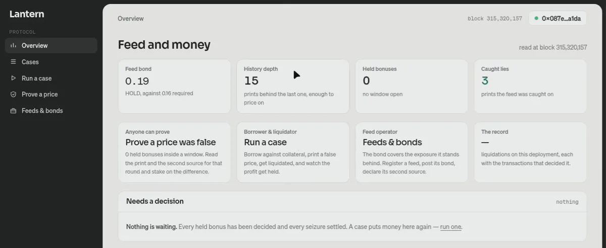

<div align="center">

# LANTERN

### A liquidator's bonus is held until someone proves the price behind it contradicted the record.


[](https://github.com/subheeksh5599/lantern/actions/workflows/test.yml)

[](demo/media/lantern-demo-narrated.mp4)
[](demo/media/lantern-demo-narrated.mp4)
[](https://friendly-fennec-31.convex.site/dashboard)
[](#whats-real-and-what-is-not)
[](#run-it)

</div>

A liquidator's bonus is paid on a price. Lantern holds that bonus back for a few minutes and lets
anyone prove, from state that is already on chain, that the price behind the liquidation was one the
feed could not honestly have published. When the proof holds, the held money goes to the borrower, the
signer's bond pays the prover and absorbs the penalty, and the feed has to carry more collateral before
it prints again. When nobody contests the window, the liquidator is paid in full.

The debt is not held back. Repayment and the closing of the position still happen at the moment of
liquidation, exactly as they did before. What becomes provisional is the profit.

**Try it: [friendly-fennec-31.convex.site/dashboard](https://friendly-fennec-31.convex.site/dashboard).**
Five views, each reading the chain rather than a mirror of it.

- **Overview** holds the four facts that decide whether the feed may price anything at all: the bond
  it carries against the bond it must carry, the depth of its print history, the bonuses still held,
  and the prints it was caught on. Below them, every held bonus whose window has closed and every
  decided seizure is listed with the one transaction that moves it. Both are permissionless, so the
  page offers the button rather than a paragraph about it. Where the move belongs to the feed
  operator and not the visitor, the row says so instead of failing.
- **Cases** is every liquidation on chain, newest first, with how it ended and the transactions that
  decided it.
- **Run a case** takes a visitor from no position to a proven lie: take out a loan, watch the feed
  print a false price and the market liquidate you on it, then prove the price contradicted the record and take
  your collateral back. Every step is a real transaction you sign. Your wallet plays the borrower and
  the prover; the feed's side is played by a small server that holds the feed operator's key, derives
  every value from the chain, and only makes the prints a case needs.

- **Prove a price** is the arguer's side, and the one page whose subject is other people's money. It
  lists the bonuses a liquidation is still holding, and for each one reads the print the feed made for
  that case's own round against the print its declared second source made for the same round. It
  offers the stake only where the comparison the contract will run says the claim holds. A refused
  challenge costs the challenger their whole stake. Beneath the held bonuses it lists the verdicts
  already reached, with its own read beside the verdict the contract recorded.
- **Feeds & bonds** is the operator's side: what a feed must carry, and how an operator registers
  one, bonds it, and declares the second source it is reconciled against. The feed id is derived from
  the reader's address and the name they type, so the page finds that feed again on the next visit.

The dashboard is a Next.js app under `site/next/`, exported to static files and served by the same
Convex deployment as the landing page. The landing page and its assets under `site/` are the source of
the marketing surface; the dashboard's encoder, formatters and selector tables are diffed against
`cast` by the test suite in `site/next/`.

```
EFFECTED   ≠   JUSTIFIED   ≠   FINAL
```

The liquidation is real the moment it happens. Whether it was justified is a separate question, and
the money that answers it is the bonus, which is held.

## Live status

| Surface | Status | The evidence |
|---|---|---|
| Six contracts | deployed | Lantern, the market, the registry, the history store and the report book, all on Arbitrum Sepolia with an exact Sourcify match on creation and runtime bytecode |
| Feed | registered and bonded | `bondOf` reads 298,901 against a `requiredBond` of 200,000: the 100,000 minimum, raised twenty per cent for each of the five prints it was caught on |
| Caught prints | 5 | `feedErrors` 5, read at block 315,567,293. Two of them were decided by the watcher |
| Challenges | 5 opened, 5 upheld | `challengesOpened` 5; every one has a verdict, and the watcher's own recomputation agrees with all five (`watcher/`, `--agree`) |
| Watcher | live | [`watcher/`](watcher/README.md) challenges what the contract will uphold and leaves the rest alone; proved end to end on a fork of this deployment, and it settled cases #42 and #44 on the live chain |
| Held bonuses | 0.00145 at rest | `heldTotal` 1,450 in the asset's own units (case #41, whose window closed unchallenged), and nothing is waiting on a decision |
| Dashboard | live | five views at [friendly-fennec-31.convex.site/dashboard](https://friendly-fennec-31.convex.site/dashboard), each reading the chain rather than a mirror of it |
| Suite | 648 passing | `forge test`: 47 suites, 648 tests, 0 failed, 0 skipped |
| Demo | 8m12s | `demo/media/lantern-demo-narrated.mp4`: a rendered explainer, then a case run end to end on the deployed site: every step, every wallet confirmation, the explorer pages, then an end card |

## ▶ Demo

[](demo/media/lantern-demo-narrated.mp4)

`8:12` · [watch it](demo/media/lantern-demo-narrated.mp4) · [local copy](demo/media/lantern-demo-narrated.mp4)

_Three parts. An explainer, animated from HTML by HyperFrames, that sets out the problem and the two
tolerances the contract uses. Then the deployed site, walked through end to end: the landing page
scrolled whole, the overview, a case opened from funding the wallet through the lie size, the loan and
its approval, the liquidation, the challenge window, the verdict, the settlement, the explorer pages
each transaction links to, the prove page, and the case list. Nothing that changes the state of the
case is cut, and the wallet's own panels and the explorer are in the edit; what is dropped is waiting,
never a step. Then an end card with what is actually live. Everything in the middle is the real site
reading real chain state, from block 315,594,195 to 315,597,565._

To rebuild it: `demo/propose.py` differences the recording at one frame a second and writes the keep
list: the seconds around every change, with a cap on anything that then sits still; `demo/newmap.py`
reads the kept seconds back to place the narration; `demo/build_cut.sh` cuts them, `demo/build_full.sh`
joins the two cards around the cut, `demo/build_narration.sh` lays the voice track and refuses to build a
line that outlasts the section it is talking about, and `demo/verify_cut.sh` reads the shipped file back
and fails on any state the demo is not supposed to show. The cards are HyperFrames compositions in
`demo/cards/`. `demo/media/lantern-intro.mp4` is the same voice over the explainer and the first two
screens, 35 seconds, for a launch post.

## The 20-second pitch

A price feed decides what a loan is worth. When a feed prints a false price, the liquidation that
follows is still a real transaction: the debt is repaid, collateral moves, and the liquidator is paid
a bonus computed on a number that was never true. Catching that before it runs means knowing what the
true price was, which is the hard part. Afterwards is easier, because by then the feed has published a
signed history and posted a bond behind it. Lantern holds the bonus for five minutes. In that window
anyone can point at the feed's own records, prove the print was one the feed could not honestly have
published, and be paid out of the feed's bond. The borrower gets the seized collateral back, the
liquidator keeps their principal and loses the profit, and the feed must carry more collateral before
it prices anything again.

## Table of contents

- [Live status](#live-status)
- [Demo](#-demo)
- [The 20-second pitch](#the-20-second-pitch)
- [Why the price needs a second look](#why-the-price-needs-a-second-look)
- [What a challenger can prove](#what-a-challenger-can-prove)
- [Printing is free, pricing is not](#printing-is-free-pricing-is-not)
- [The bond answers for the position](#the-bond-answers-for-the-position)
- [The floors follow the asset](#the-floors-follow-the-asset)
- [No owner](#no-owner)
- [Live on Arbitrum Sepolia](#live-on-arbitrum-sepolia)
- [Who actually challenges](#who-actually-challenges)
- [What's real and what is not](#whats-real-and-what-is-not)
- [Run it](#run-it)
- [Documentation](#documentation)

## Why the price needs a second look

A liquidation consumes a price and produces a payment. If the price was fabricated, the payment is real
anyway, and the borrower is the one left short. Checking a price before the liquidation runs means
knowing what the true price was, and that is the hard part. Afterwards is easier. By then the feed has
published a history, and its signer has put collateral behind it. Lantern asks the
question at the only point where an answer can be produced as evidence, which is afterwards.

## What a challenger can prove

Five rules. Each one is a predicate over state, and the verdict is recomputed in the contract at
adjudication, so a challenger supplies the rule and the evidence rather than an answer.

1. `SLOT_UNIQUENESS`: one feed printed two different values for one round. The conflict is recorded
   instead of hidden behind a revert, so the record outlives the transaction that made it.
2. `ROUND_ORDERING`: the print was already stale when the liquidation consumed it.
3. `SELF_HISTORY`: the value falls outside the band that the feed's own realized moves imply. That band
   is computed from the feed's history and nothing else. No reference price is set by hand, and no
   committee signs off on it.
4. `PAYLOAD_PROVENANCE`: the signed payload was issued for a different asset or a different slot.
5. `CROSS_SOURCE`: a second feed, named by the operator in advance and impossible to change afterwards,
   disagrees beyond tolerance for the same round. The disagreement itself is the evidence, so the rule
   works without trusting either source.

## Printing is free, pricing is not

A band built from one print is wide enough to excuse nearly any number, and that is the state an
attacker would arrange before printing one they invented. So a liquidation may only be priced on a print
that had at least four prints behind it, and the count is snapshotted on the report itself rather than
recomputed later. A feed below the floor keeps printing as freely as it likes, because printing is how
it builds the history it needs.

## The bond answers for the position

A bond sized against the bonus can only ever give back the bonus. The market reports what the
liquidation put at risk, and the bond has to cover a fixed share of it, so recovery is not capped by the
profit that happens to be held. The share is a policy choice, written in `Constants` and tested at its
boundary rather than asserted in a comment.

## The floors follow the asset

The minimum bond and the minimum stake come from the asset's own decimals, read once at construction. A
six-decimal stablecoin is usable, and an asset above 18 decimals is refused instead of rounded. A token
that keeps a cut of every transfer is refused as well. Crediting an amount that never arrived would
corrupt every balance the mechanism depends on, and it is cheaper to say no than to account for it.

## No owner

No pause, no setter, no upgrade, no admin key. The hold window and the bounty share are constructor
arguments, and the registry is built by the contract itself, so there is nothing left to trust once the
deployment lands. The one operator-controlled value that can still be written is the one-shot peer
declaration, and after it is set it cannot be changed.

## Live on Arbitrum Sepolia

| Contract | Address |
|---|---|
| Lantern | `0xcdce3a1b3ebf7fe1e340ab670e25fe768195ac54` |
| Market (a lending market) | `0x290714d09f6d1ab50f7c31698eda92993ab01f95` |
| Collateral | `0x980B62Da83eFf3D4576C647993b0c1D7faf17c73` (Arbitrum's wrapped ether) |
| Asset (settlement) | `0x185690fb4d3c765bac544423a34953b2b8b03a22` |
| Second source (Chainlink) | `0xe682D11a014E82D62eb0fAaCb1bc60E12ce2De6c` |

Lantern's constructor builds the feed registry and, under it, the history store and the report book; all
three addresses are in [docs/DEPLOYMENTS.md](docs/DEPLOYMENTS.md) with the block they landed at.

Machine-readable in [deployments.json](deployments.json); the ABI in [abi/](abi/); every read and
command in [docs/DEPLOYMENTS.md](docs/DEPLOYMENTS.md).

The chain currently says three caught prints (`feedErrors` 3), on a market that is a real one. Each began
the same way: a borrower put up wrapped ether, borrowed the settlement asset against it, and the feed
printed below what both sources agree on - inside the 20% a single report may move, outside the 5% two
sources must agree within. The three decided cases read 16.54%, 18.05% and 19.38% apart on the page's own
comparison of the print against the second source. The market prices from that feed and nothing else, so
by its own rule the position was unhealthy and it closed part of it, reporting the notional it actually
consumed. Each verdict compared the print with a live aggregator on the same round and upheld the
challenge, handing the seized collateral back to the borrower and redirecting the liquidator's profit to
them: the liquidator kept their principal and nothing else. A caught print raises what the feed must carry
by twenty per cent, so its required bond now reads 160,000 against the 100,000 minimum, and the operator
is carrying 199,204.

The collateral is Arbitrum's own wrapped ether, so a position is backed by something a borrower really
parted with. The settlement asset is a faucet token because on a testnet a stablecoin cannot be minted
on demand, and a test double with an open `mint` would let anyone conjure a bond out of nothing; this one
is claimed, one capped claim per address per cooldown. On mainnet that constructor argument is a
stablecoin and nothing else about the system moves.

This deployment is the current source. `script/verify-source.sh` checks it the way it has to be checked:
deployed runtime code cannot be byte-identical to the artifact, because the constructor substitutes the
immutables into it, so the check is that the two are the same length, that the metadata trailer is
identical - which pins compiler, sources and settings - and that every differing byte is a slot the
artifact leaves zero. Lantern passes with 38 such slots, the market with 66, the asset with 7, the
registry with 15, the history store with 6 and the report book with 6 - all six read from
`deployments.json` rather than typed into the script, so a redeploy cannot leave the check proving an
instance nobody is using. The floor and the notional requirement are live, not merely in the tests.

All six contracts verify on Sourcify with an exact match on creation and runtime bytecode
(`make verify-source` for the bytecode check), and the source is readable on the public explorer with
no key at `arbitrum-sepolia.blockscout.com/address/<address>`.

## Who actually challenges

"Anyone can challenge" is only a permission, so the repository ships the program that does it.
[`watcher/`](watcher/README.md) reads every held bonus and, for each one, the same state
`adjudicate` will read. It runs the five rules on that state and, while the window is open, stakes
the minimum against the cases the contract will uphold. It needs no price data of its own: every
input is a read of contracts that are already deployed.

- **On the live chain:** two `CROSS_SOURCE` challenges, #42 and #44, had been opened and then
  abandoned past the grace period. Anyone could have voided them, which hands the stake to the
  liquidator without checking the claim. The watcher adjudicated them instead, and both were upheld:
  [`0x55e96586…`](https://arbitrum-sepolia.blockscout.com/tx/0x55e96586f9616c8524d80f21a407d5d728cf278db44a30b7631e21199a640c2d),
  [`0x4444c67f…`](https://arbitrum-sepolia.blockscout.com/tx/0x4444c67ff998a5be2a0a6d943ab5f022fa920336035cee1eeff736fd4058cb5e).
- **Prediction against the contract:** `node bin/watch.mjs --agree` recomputes every verdict on chain
  and compares. It reads 5/5.
- **End to end, on a fork of this deployment:** two fresh liquidations go through the real market.
  - An 18% gap is challenged by a key that never touched the deployment, and the bonus goes to the borrower.
  - A 4% gap, enough to liquidate a 99% loan but inside the 5% tolerance, is left alone.
  - Both outcomes are checked from chain state (`npm run fork`).

## What's real and what is not

| Claim | State | The evidence, or what closes it |
|---|---|---|
| The rules are decided by the contract, not by the page | real | the verdict is recomputed inside `adjudicate`; a challenger supplies the rule and the evidence, never an answer |
| Every button on the dashboard sends a real transaction | real | `site/next/scripts/wallet-e2e.cjs` drives each page with an injected wallet; the receipts are listed in `docs/DASHBOARD.md` |
| The demo shows the deployed site, not a mock | real | recorded from the live domain between block 315,594,195 and 315,597,565, narrated, and committed in `demo/media/` |
| The demo is an edit, not a raw capture | stated | the raw recording is 16m09s and the edit is 8m12s; what is dropped is waiting: the five-minute hold, MetaMask sitting on a blank panel while the chain catches up, and the explorer fetching its own bundle. Every step, every confirmation and every explorer page is in the edit |
| A visitor can run a whole case | real, with one dependency | every step is a transaction the visitor signs, so their own wallet needs testnet ether; step 1 links the faucet rather than hiding it |
| The deployment can start a case for a visitor | real, and it says so when it cannot | the server holds the feed operator's key and needs a minimum balance; when it is short, the run page says the deployment is out of gas instead of failing a button |
| Someone actually watches | real, run by us | `watcher/` decided cases #42 and #44 on the live chain; whether third parties would run one for a 20% bounty is an open question (see `docs/LIMITS.md`) |
| Mainnet | not deployed | this is Arbitrum Sepolia, the footer says testnet only, and the settlement asset is a faucet token |

## Run it

```
forge build
forge test                                      # 648 tests: unit, fuzz, integration, invariants
forge test --match-path "test/invariants/*"      # stateful invariants over random action sequences
forge test --match-path "test/gas/*" --gas-report
forge script script/Deploy.s.sol --rpc-url arbitrum_sepolia --broadcast -vv
forge script script/DemoRun.s.sol --rpc-url arbitrum_sepolia --broadcast -vv
forge script script/ReportFromChainlink.s.sol --rpc-url arbitrum_sepolia --broadcast -vv
forge script script/ChallengeWithChainlink.s.sol --rpc-url arbitrum_sepolia --broadcast -vv
```

The watcher, from `watcher/`:

```
npm install && npm test                         # the rule mirror against the Solidity: 44 checks
node bin/watch.mjs --agree                      # recompute every verdict on chain and compare
npm run fork                                    # two fresh liquidations on a local fork, checked from state
WATCHER_ACCOUNT_FILE=~/.watcher.json node bin/watch.mjs   # watch the live deployment
```

The four scripts run in order and each later one needs the addresses the first printed, so
`make redeploy` runs the whole sequence against the addresses it just made and refuses to run the demo
against a deploy that did not land. `make deploy`, `make demo`, `make report`, and `make challenge` run
them one at a time; `.env.example` lists every variable they read.

The dashboard is a separate build:

```
cd site/next && npm install
npm test                              # diffs the encoder, the selectors and the panel rows
cd ../../convex-host && npm run deploy
```

`npm run deploy` does the whole deploy: it builds the site, copies the export into `dist/`, pushes the
functions, and uploads the files, in that order, one command. It targets this repository's production
deployment (`prod:friendly-fennec-31`) rather than whatever `.env.local` points at, because
`convex deploy` refuses to choose a production target without being told and cannot be asked in a
non-interactive shell. Deploy only the site or only the functions with
`npm run build && npx @convex-dev/static-hosting deploy --no-spa --skip-build --skip-convex` and
`npx convex deploy` respectively.

## Documentation

| Document | Contents |
|---|---|
| [docs/TOUR.md](docs/TOUR.md) | a reading order for someone with ten minutes |
| [docs/DESIGN.md](docs/DESIGN.md) | the mechanism, and why the bonus is the disputed object |
| [docs/RULES.md](docs/RULES.md) | each rule as a predicate, with the tests that pin it |
| [docs/BAND.md](docs/BAND.md) | where the tolerance comes from, and its two guards |
| [docs/ECONOMICS.md](docs/ECONOMICS.md) | the numbers, who pays whom, and the escalation |
| [docs/ARCHITECTURE.md](docs/ARCHITECTURE.md) | the modules, who may do what, and the flow of one liquidation |
| [docs/INVARIANTS.md](docs/INVARIANTS.md) | what must always hold, each with a test that attacks it |
| [docs/LIMITS.md](docs/LIMITS.md) | what this is not, and the sharp edges, stated plainly |
| [docs/SECURITY.md](docs/SECURITY.md) | every attack attempted, and the test that shows the outcome |
| [docs/INTEGRATION.md](docs/INTEGRATION.md) | how a market wires it in, and the failure modes |
| [docs/FAQ.md](docs/FAQ.md) | the objections, answered without hedging |
| [docs/DEPLOYMENTS.md](docs/DEPLOYMENTS.md) | the Sepolia deployment and its on-chain reads |
| [docs/TESTING.md](docs/TESTING.md) | the shape of the suite and what it covers |
| [docs/COVERAGE.md](docs/COVERAGE.md) | line and branch coverage, and what it leaves out |
| [docs/DEMO.md](docs/DEMO.md) | the acts, and the commands that reproduce them |
| [docs/DASHBOARD.md](docs/DASHBOARD.md) | the five views, what each reads, and how it is tested |
| [GAS.md](GAS.md) | measured cost |
